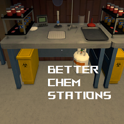

# Better Chemistry Stations

A MelonLoader mod for Schedule I that automatically filters Chemistry Station slots based on the selected recipe.



## Features

- **Smart Slot Filtering**: Chemistry Station input slots will only accept ingredients required by the selected recipe
- **Quality-Aware**: Accepts ingredients of any quality level (1-5 stars) as long as they match the required item type
- **Improved Workflow**: No more accidentally putting the wrong ingredients in the wrong slots!
- **Works Automatically**: Filters update whenever you change recipes or load a saved game
- **Zero Configuration**: Works right out of the box with no setup needed

## Quick Start Guide

1. Install the mod following the instructions below
2. Launch the game and enjoy filtered Chemistry Stations!

Filters are applied in two ways:

- When a station is first loaded in your game
- When you change a recipe using the Management Clipboard

That's it! The slots will filter ingredients based on the recipe selected, allowing any quality level of the required items.

## Why You Need This

Ever get frustrated putting the wrong ingredients in your Chemistry Station? This mod solves that problem by:

- Clearly showing which ingredients belong in which slots
- Preventing you from placing incorrect items
- Accepting any quality level of the required ingredients (great for using up lower quality items!)
- Saving time and reducing errors in your chemistry workflows

If you have suggestions for additional features, please share them on the issues page!

## Installation

1. Install [MelonLoader](https://melonwiki.xyz/#/README) for Schedule I
2. Download the latest version of BetterChemStations from the [Releases page](https://github.com/YourUsername/BetterChemStations/releases)
3. Place `BetterChemStations.dll` in your `Schedule I/Mods` folder
4. Launch the game and enjoy!

## How It Works

When a Chemistry Station loads or its recipe changes:

1. The mod detects which ingredients are required for the recipe
2. Each input slot is configured to only accept its corresponding ingredient, regardless of quality level
3. The game's existing item system handles the rest, showing valid items highlighted and invalid items dimmed

### Item Quality Support

Version 1.2.0 adds support for different quality levels:

- The mod now filters by item ID only, ignoring quality requirements
- This means you can use a 1-star ingredient even if the recipe shows a 3-star one
- Great for using up lower quality materials or making high-quality items with better ingredients

Here's what it looks like in action:


## Configuration (Optional)

This mod works without any configuration, but for troubleshooting purposes, you can enable debug logging.

After running the mod once, a configuration file will be created at `Schedule I/UserData/MelonPreferences.cfg`.

### Configuration Options

- **DebugMode** (Default: `false`) - Enable detailed logging for troubleshooting

Example configuration:

```
[BetterChemStations]
DebugMode = false
```

## Compatibility

- Works with Schedule I version 0.3.4f4 Alternate
- Compatible with other MelonLoader mods
- Should be compatible with future game updates (unless the Chemistry Station system changes significantly)

## Troubleshooting

If you encounter issues:

1. Enable **DebugMode** in the configuration file
2. Restart the game
3. Check the MelonLoader console for detailed logs
4. Report issues on the [GitHub Issues page](https://github.com/YourUsername/BetterChemStations/issues) with the logs attached

## Update History

### Version 1.2.0

- Added support for accepting ingredients of any quality level
- Now filters by item type only, allowing any star-level of the required ingredient

### Version 1.1.0

- Added support for stations on game load
- No longer need to manually configure stations after loading a save

### Version 1.0.0

- Initial release
- Basic filtering functionality

## Credits

- Thanks to the MelonLoader team for their modding framework
- Thanks to the Schedule I community

## License

This project is licensed under the MIT License - see the LICENSE file for details.
